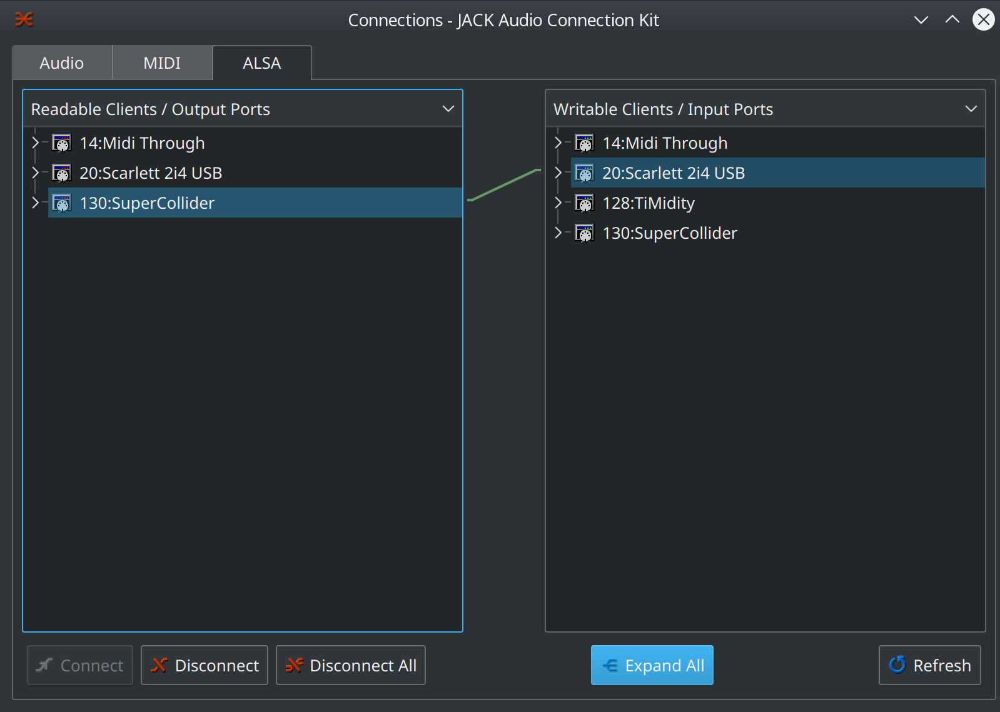

# Sequencing MIDI using ProxySpace and Pbind

------------------

I didn't get into live coding with MIDI initially, and it's only after a couple of years of performing that I decided to get a synth to work into my sets - and while the examples I am providing here _should_ work with any MIDI Synth, I've probably only tested them on mine (a [Make Noise 0 Coast](http://www.makenoisemusic.com/synthesizers/ohcoast)).

Fortunately it's relatively easy to get MIDI sequences working in conjunction with the standard ProxySpace patterns described all over this repo. I based these instructions on the ones in the [Pattern Guide Cookbook](http://doc.sccode.org/Tutorials/A-Practical-Guide/PG_Cookbook04_Sending_MIDI.html).

IMPORTANT! - This is a guide for setting up MIDI using _Linux_. OSX is probably similar, but Windows I am really not too sure about.

First you need to initialise MIDI on the server with `MIDIClient.init`. This will initialise MIDI on the server and print available MIDI devices to the post window, on my system they are listed as the following:

```
MIDI Sources:
	MIDIEndPoint("System", "Timer")
	MIDIEndPoint("System", "Announce")
	MIDIEndPoint("Midi Through", "Midi Through Port-0")
	MIDIEndPoint("Scarlett 2i4 USB", "Scarlett 2i4 USB MIDI 1")
	MIDIEndPoint("SuperCollider", "out0")
	MIDIEndPoint("SuperCollider", "out1")
	MIDIEndPoint("SuperCollider", "out2")
	MIDIEndPoint("SuperCollider", "out3")
	MIDIEndPoint("SuperCollider", "out4")
	MIDIEndPoint("SuperCollider", "out5")
MIDI Destinations:
	MIDIEndPoint("Midi Through", "Midi Through Port-0")
	MIDIEndPoint("Scarlett 2i4 USB", "Scarlett 2i4 USB MIDI 1")
	MIDIEndPoint("TiMidity", "TiMidity port 0")
	MIDIEndPoint("TiMidity", "TiMidity port 1")
	MIDIEndPoint("TiMidity", "TiMidity port 2")
	MIDIEndPoint("TiMidity", "TiMidity port 3")
	MIDIEndPoint("SuperCollider", "in0")
	MIDIEndPoint("SuperCollider", "in1")
	MIDIEndPoint("SuperCollider", "in2")
	MIDIEndPoint("SuperCollider", "in3")  
```

Then use the [`MIDIOut`](http://doc.sccode.org/Classes/MIDIOut.html) class to create a MIDI Output, specifying the MIDI output you would like to use as a string. I add this to the dictionary that I store samples in, like this:

```supercollider
d[\m2] = MIDIOut.newByName("Scarlett 2i4 USB", "Scarlett 2i4 USB MIDI 1").latency = (0.2555)
```

The `latency` method is used to create latency in the MIDI signal, in order to sync the MIDI notes played by SuperCollider to the latency of the audio server - this will need some tweaking (see the accompanying `.scd` file).

MIDI sequences can then be sent from within ProxySpace as a `Pbind`, the same as any other pattern, with a few extra values necessary:

```supercollider
(
~midiPattern = Pbind(
    //specifies type of message sent
    \type, \midi,
    //specifies type of midi message
    \midicmd, \noteOn,
    //the MIDI Out used
	\midiout, d[\m],
  //the MIDI channel
    \chan, 0,
    //The rest of the pattern
	\scale,Scale.minor,
	\degree, Pseq([0,2,4],inf),
	\octave, 3,
	\dur, 0.5,
	\legato, 0.4
)
)
```

If this doesn't work, there's possibly a routing issue. If you're using Linux, load up `Qjackctl`, select `connect`, then go to `ALSA` and connect output `SuperCollider` to your MIDI interface:



You should now be patterning your MIDI device, Enjoy.

I don't really like MIDI as a technology because it is quite restrictive, particularly  as it only takes 'note' messages rather than frequencies (messages are often limited to 0-127 ints). The result of this is that microtones of any kind are hard to specify. One way to create microtones is to use the `\bend` feature, which takes values from `0` to `16,383` (with `8,192` being the middle, or default).

```supercollider
(
~midiBend = Pbind(
\type,\midi,
\midicmd,\bend,
\midiout,d[\m],
\chan,0,
\dur,0.25,
\val,Pwhite(0,16383)
)
)
```

The amount that the pitch bend affects the pitch of the synth is set within the synth itself, in my case it is +/- 1 semitone. The code above results in a semi-microtonal scale, played out across one tone.

Note that the pitch bend _cannot_ be specified at the same time as the notes, it must be specified separately, for reasons I don't quite understand.
